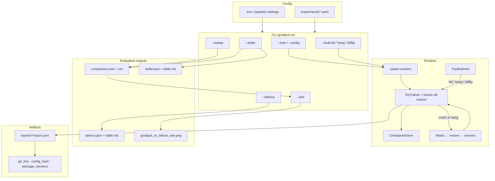

# Architecture

## System overview

Goodput is a **batch experiment harness**, not an online inference service. Components are swappable via provider interfaces so CI can run without GPUs, Docker, or real process kills.



**One-command portfolio:** `./scripts/portfolio-demo.sh` runs the smoke train, sweep, latency table, and dollar estimate from committed YAML (ticket 3.5).

## Fault recovery vs silent corruption

Kill and hang **stop** synchronized progress; bit-flip **continues** with poisoned gradients.

```mermaid
sequenceDiagram
  participant P as Parent
  participant W0 as Rank 0
  participant W1 as Rank 1

  Note over P,W1: Kill / hang (checkpointed)
  P->>W0: train + ckpt at step K
  P->>W1: inject kill or hang at step K
  alt kill
    P->>P: SIGKILL worker
  else hang
    P->>P: progress timeout (liveness)
  end
  P->>P: reap peers, restore latest.pt
  P->>W0: resume remaining steps

  Note over P,W1: Bit-flip (no restore)
  P->>W1: XOR grad sign bit at step K
  W0->>W0: optional desync detector
  W0->>W0: all-reduce average (corrupted)
  Note over W0,W1: training continues; loss diverges
```

## Data → train → eval → “serve”

| Stage | What happens here | MVP implementation |
|-------|-------------------|--------------------|
| Data | Synthetic tensors / fixture files | `src/goodput/data/` — no raw datasets in git |
| Features | Minimal (identity / flatten) | `src/goodput/features/` stub |
| Models | Tiny MLP / linear toy | `src/goodput/models/` |
| Training | Multi-worker loop + barriers | `src/goodput/training/` |
| Checkpoint | Save/restore providers | `src/goodput/checkpointing/` + `providers/` |
| Faults | Kill, hang, bit-flip injectors | `src/goodput/faults/` + `providers/` |
| Evaluation | Sweep, latency, dollar, scale, plot | `src/goodput/evaluation/` |
| Metrics | Goodput + repro pack | `src/goodput/metrics/` |
| Inference / serving | **Out of MVP scope** | Packages reserved; no FastAPI app yet |

## Three-story portfolio (Phase 3 exit)

| Story | Question | Command | Artifact |
|-------|----------|---------|----------|
| **1 — Goodput curve** | Does faster checkpointing buy goodput under failure? | `goodput-run --sweep experiments/sweep.yaml --plot` | `artifacts/sweeps/phase2-sweep/`, `artifacts/plots/` |
| **2 — Scale latency** | How does ckpt save/restore vs worker count behave? | `goodput-run --latency experiments/latency.yaml` | `artifacts/sweeps/latency-table/table.md` |
| **3 — Dollar narrative** | What is a labeled $ impact of a measured Δgoodput? | `goodput-run --dollar experiments/dollar.yaml` | `artifacts/sweeps/dollar-impact/table.md` |

Each per-run JSON report also carries **reproducibility** fields (ticket 3.4): `git_sha`, `config_hash`, `package_versions`.

**Stretch (4.1):** `goodput-run --scale experiments/scale.yaml` — goodput vs simulated cluster size N (interruption rate ∝ N). See [`scale.md`](scale.md).

## Provider pattern (CI-critical)

```text
CheckpointStore (ABC)
  ├── MockCheckpointStore      # in-memory; CI
  └── LocalFsCheckpointStore   # disk artifacts

FaultInjector (ABC)
  ├── MockFaultInjector        # records intent; no SIGKILL in CI
  └── ProcessFaultInjector     # real SIGKILL / hang / bitflip schedule

MetricsSink (ABC)
  ├── StdoutMetricsSink
  └── JsonFileMetricsSink      # artifacts/reports/<run>/report.json
```

CI **must** default to mock/lightweight providers. Real process kills run in integration/manual tests only.

## Deployment targets

| Target | Role |
|--------|------|
| Local processes | Day-to-day dev + unit/integration |
| Docker Compose | Demo “cluster” of N containers (single-process ranks, shared volume) |
| Colab (optional) | GPU demo |
| Cloud VMs (stretch) | Multi-node timing fidelity |

## Fidelity notes

- Toy **barrier + shared-tensor all-reduce**, not full PyTorch DDP.
- Compose nodes are **parallel single-process trainers** on a shared checkpoint volume — not cross-container all-reduce.
- Sweep cells use **soft crash + resume**, not SIGKILL, so CI stays deterministic.
- Dollar table is **back-of-envelope** public list pricing × simulated cluster — not a cloud quote.

## Why no database / frontend (MVP)

Experiment cardinality is low (tens to hundreds of runs). JSON reports + YAML configs are enough to reproduce charts. A DB or UI would delay the goodput curve without improving the engineering story.
