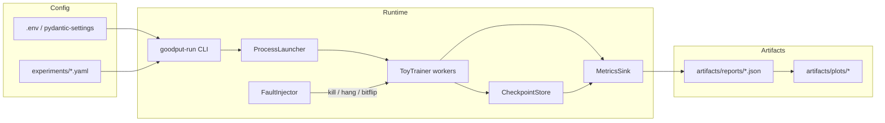

# Architecture

## System overview

Goodput is a **batch experiment harness**, not an online inference service. Components are swappable via provider interfaces so CI can run without GPUs, Docker, or real process kills.



## Data → train → eval → “serve”

| Stage | What happens here | MVP implementation |
|-------|-------------------|--------------------|
| Data | Synthetic tensors / fixture files | `src/goodput/data/` — no raw datasets in git |
| Features | Minimal (identity / flatten) | `src/goodput/features/` stub |
| Models | Tiny MLP / linear toy | `src/goodput/models/` |
| Training | Multi-worker loop + barriers | `src/goodput/training/` |
| Checkpoint | Save/restore providers | `src/goodput/checkpointing/` + `providers/` |
| Faults | Injectors | `src/goodput/faults/` + `providers/` |
| Evaluation | Goodput & timing metrics | `src/goodput/evaluation/` + `metrics/` |
| Inference / serving | **Out of MVP scope** | Packages reserved; no FastAPI app yet |

## Provider pattern (CI-critical)

```text
CheckpointStore (ABC)
  ├── MockCheckpointStore      # in-memory; CI
  └── LocalFsCheckpointStore   # disk artifacts

FaultInjector (ABC)
  ├── MockFaultInjector        # records intent; no SIGKILL in CI
  └── ProcessFaultInjector     # real SIGKILL / hang signals

MetricsSink (ABC)
  ├── StdoutMetricsSink
  └── JsonFileMetricsSink
```

CI **must** default to mock/lightweight providers. Real process kills run in integration/manual tests only.

## Deployment targets

| Target | Role |
|--------|------|
| Local processes | Day-to-day dev + unit/integration |
| Docker Compose | Demo “cluster” of N containers |
| Colab (optional) | GPU demo for portfolio |
| Cloud VMs (stretch) | Multi-node timing fidelity |

## Why no database / frontend (MVP)

Experiment cardinality is low (tens to hundreds of runs). JSON reports + YAML configs are enough to reproduce charts. A DB or UI would delay the goodput curve without improving the interview story.
