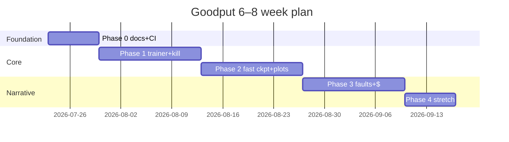

# Roadmap

High-level view. Details and Done-when criteria live in [`master-plan.md`](master-plan.md).

| Phase | Theme | Approx weeks | Demo-able outcome |
|-------|-------|--------------|-------------------|
| **0** | Foundation | 1 | Docs + CI + importable package |
| **1** | Kill → restore → goodput | 2–3 | 2-worker crash recovery with a number |
| **2** | Fast ckpt A/B | 4–5 | Goodput vs failure-rate chart |
| **3** | Harder faults + $ story | 6–7 | Hang/bitflip + dollar delta |
| **4** | Stretch scale | 8+ | Workers×goodput / Colab / tracker |

Dates are relative to Phase 0 start; adjust `what_i_learned.md` weekly.
